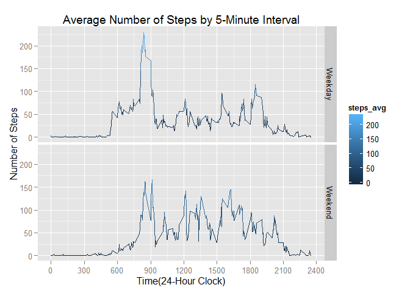

# Peer Assesment 1

This is my work for peer assessment 1, wherein I created summary graphics for the data from an activity tracker.  The data comes from a single subject who wore an activity tracker for a 2-month period.  The tracker provided data that is broken into 5-minute intervals for each day in the dataset.

###First Task: What is mean total number of steps taken per day?

Opening the data.

```r
activity <- read.csv("activity.csv")
```

1.) My first step is to use the dplyr package to group the database by day and then create a data frame that contains the total number of steps for each day

```r
activity <- read.csv("activity.csv")

library(dplyr)
```

```
## 
## Attaching package: 'dplyr'
## 
## The following objects are masked from 'package:stats':
## 
##     filter, lag
## 
## The following objects are masked from 'package:base':
## 
##     intersect, setdiff, setequal, union
```

```r
#Creating the data frame:
by_day <- group_by(activity, date)
Daily_Steps <- summarise(by_day, steps = sum(steps, na.rm=TRUE))
```

2.) Now to plot the daily step totals in a histogram. I am using ggplot2 to plot the data and then using the scales package to make the break points on the y-axis cleaner. As can be seen in the histogram, there are at least 10 days with either no data or minimal data.

```r
library(ggplot2)
library(scales)
ggplot(data=Daily_Steps, aes(steps)) +
  geom_histogram(breaks=seq(0, 25000, by =500), 
		aes(fill=..count..),
		alpha=.8) +
	labs(title="Histogram of Daily Step Count") +
	labs(x="Number of Steps", y="Number of Days") +
	ylim(c(0,10)) +
	scale_y_continuous(breaks= pretty_breaks())
```

```
## Scale for 'y' is already present. Adding another scale for 'y', which will replace the existing scale.
```

 

3.) The below code finds the mean and median number of steps each day

```r
mean_steps <- mean(Daily_Steps$steps, na.rm=TRUE)
mean_steps <- format(round(mean_steps, 2), nsmall = 2)
median_steps <- median(Daily_Steps$steps, na.rm=TRUE)
```

Across the two months of data, the average number of steps the subject took was 9354.23, while the median number of steps was 10395.


###Second Task: What is the average daily activity pattern?


1.) In order to create a time-series plot of the mean number of steps across all 5-minute intervals, I am again using the dplyr package.  This time I am grouping the database by interval and then finding the average number of steps in those intervals across 60 days in the dataframe.  I am also using ggplot to create the time-series plot.


```r
#finding the average acorss interval
by_interval <- group_by(activity, interval)
Interval_Steps <- summarise(by_interval, steps_avg = mean(steps, na.rm=TRUE))

#Now to plot the average number of steps taken over the entire Two month period
#in each 5-minute interval period
ggplot(Interval_Steps, aes(x=interval, y=steps_avg)) +
    geom_line(aes(colour=steps_avg)) +
  scale_x_continuous(breaks=c(0,300,600,900,1200,1500,1800,2100,2400)) +
	labs(title="Average Number of Steps by 5-Minute Interval") +
	labs(x="Time(24-Hour Clock)", y="Number of Steps")
```

 

2.) The code below find the 5-minute interval, on average across all the days in the dataset, that contains the maximum number of steps.

```r
max_interval <- Interval_Steps$interval[which.max(Interval_Steps$steps)]
```

The interval with the greatest average number of steps occured at 835 AM.


###Third Task: Imputing Missing Values


1.) Here is how I found the total number of missing values in the dataset

```r
tot_missing <- length(which(is.na(activity$steps)))
```

In total, there are 2304 missing values in the data set (a missing value is a 5-minute interval without an observation).


2.) & 3.) My strategy to fill-in the missing interval values was to find the average number of steps in that given interval across the 2 months. I am not using the average daily number of steps because of what can be seen in the above histogram: there are quite a few days that are entirely missing or have very few observations. In order to do this, I will start by using the "interval average" variable I created in Task #2 (I called it steps_avg). Dplyr will allow me to join the original dataframe with the dataframe containg the "interval average" in order to replace all missing intervals with that interval's 2-month average.


```r
colnames(Interval_Steps)[2] <- "steps_avg"
activity2 <- left_join(activity, Interval_Steps, by = "interval")
activity2$steps[is.na(activity2$steps)] <- activity2$steps_avg[is.na(activity2$steps)]
```

4.) I am now re-doing the histogram from Task #1, but using the data with the imputed missing values.  I am re-doing my work from Task 1 here.


```r
#Fidning the new averages and creating the new dataframe
by_day2 <- group_by(activity2, date)
Daily_Steps2 <- summarise(by_day2, steps = sum(steps, na.rm=TRUE))


#Now to plot the daily step totals in a histogram
ggplot(data=Daily_Steps2, aes(steps)) +
  geom_histogram(breaks=seq(0, 25000, by =500), 
		aes(fill=..count..),
		alpha=.8) +
	labs(title="Histogram of Daily Step Count") +
	labs(x="Number of Steps", y="Number of Days") +
	ylim(c(0,12)) +
	scale_y_continuous(breaks= pretty_breaks())
```

```
## Scale for 'y' is already present. Adding another scale for 'y', which will replace the existing scale.
```

 

```r
#Finding the mean and median of steps per day, they are now larger after 
#sustituting for the NAs
imputed_mean <- mean(Daily_Steps2$steps, na.rm=TRUE)
imputed_mean <- format(round(imputed_mean, 2), nsmall = 2)
imputed_median <- median(Daily_Steps2$steps, na.rm=TRUE)
imputed_median <- format(round(imputed_median, 2), nsmall = 2)
```


After imputing missing values, the overall mean number of daily steps increased from 9354.23 to 10766.19, while the median number of steps increased from 10395 to 10766.19.  This is an expected finding given that we earlier found there to be 10 days with missing/minimal data in the original dataframe.  The new histogram shows that the number of days with missing/minimal data decresed from 10 to 2.


###Fourth Task: Graphing the difference in activity between weekdays and weekends.


1.) Below is my code to create the factor variable indicating if the day is on the weekend or weekday


```r
#usign weekday() to indicate the day of the week
activity2$Day <- weekdays(as.Date(activity2$date))
activity2$sat <- as.numeric(activity2$Day=="Saturday")
activity2$sun <- as.numeric(activity2$Day=="Sunday")
activity2$weekend <- activity2$sat + activity2$sun
activity2$sat <- NULL
activity2$sun <- NULL

#Cretign a df for weekend and weekdays, I doing this in order to complete the next step
week_end <- subset(activity2, weekend==1)
week_day <- subset(activity2, weekend==0)
```

2.) Below I am creating the two panel plots to show the difference in activities across the weekend and weekday.  As can be seen in the plot, there is quite a difference in walking pattern between the weekend and weekdays.  The person wearing the watch tends to not rush as much in morning on the weekends and walks a little more during the day time.  On weekdays, he clearly does a bit of walking in the morning (possibly to get to work or class) and is sedentary during the day.


```r
#First creating the data frames of steps averaged by days during the week and
#days during the weekend, and re-merging back together 
week_day_interval <- group_by(week_day, interval)
week_day_steps <- summarise(week_day_interval, steps_avg = mean(steps, na.rm=TRUE))
week_day_steps$weekend <- "Weekday"

week_end_interval <- group_by(week_end, interval)
week_end_steps <- summarise(week_end_interval, steps_avg = mean(steps, na.rm=TRUE))
week_end_steps$weekend <- "Weekend"

week_steps <- merge(week_day_steps, week_end_steps, all=TRUE)

#Now to create the 2 separate plots
ggplot(data = week_steps, aes(interval, steps_avg)) +
     geom_line(aes(colour=steps_avg)) +
     facet_grid(weekend ~ .) +
  scale_x_continuous(breaks=c(0,300,600,900,1200,1500,1800,2100,2400)) +
	labs(title="Average Number of Steps by 5-Minute Interval") +
	labs(x="Time(24-Hour Clock)", y="Number of Steps")
```

 
library(knitr)
knit2html("PA1_template.Rmd")
